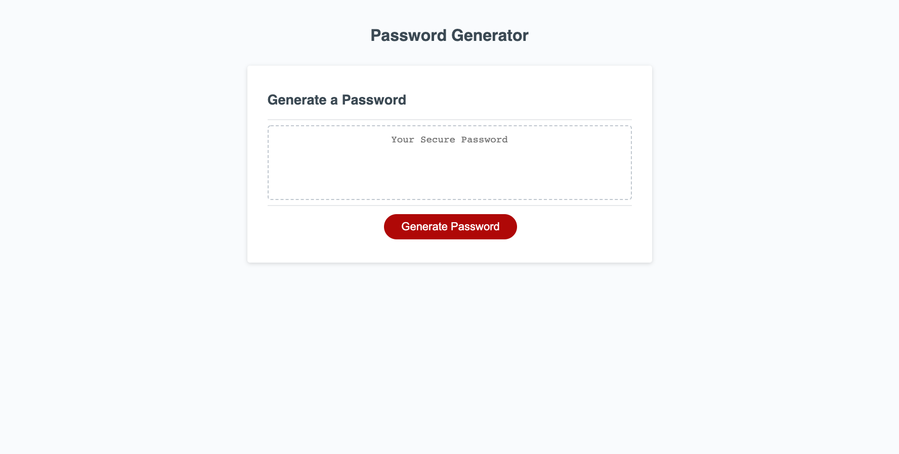
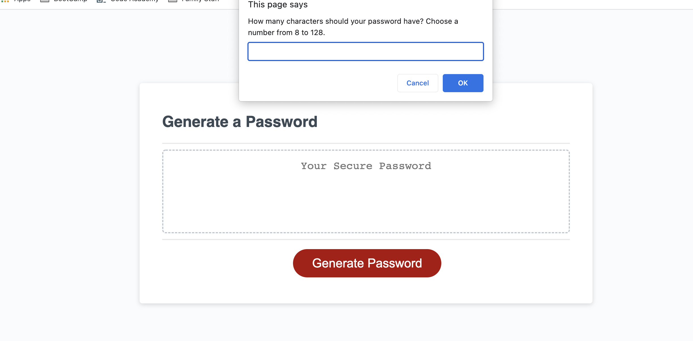

# Create a Password Generator

## Project Description
The purpose of this project was to create a password generator to create a new, secure password. It involved creating a series of window methods including prompt(), confirm(), and alert(); validating each method, and using the variables captured to generate the random password. I used a variety of resources to structure the code as efficiently as possible including code from previous lessons, MDN documentation, W3 Schools and Code Academy lessons, asking questions of classmates about how to store and retrieve variables, and JS Fiddle where I tested a lot of code when trying to restructure it for efficiency before incorporating it into the code files. This process helped me to gain a deeper understanding of variables, functions, and methods in JavaScript. 

Starter code with HTML, CSS, and JS files was provided. I made minor changes to the HTML file to update the links for the CSS and JS files. I did not revise the CSS file for this project although in the future I plan to add Media Queries to make the password generator more responsive on mobile devices. 

### Following is the acceptance criteria for the project assignment:
GIVEN I need a new, secure password
WHEN I click the button to generate a password
THEN I am presented with a series of prompts for password criteria
WHEN prompted for password criteria
THEN I select which criteria to include in the password
WHEN prompted for the length of the password
THEN I choose a length of at least 8 characters and no more than 128 characters
WHEN asked for character types to include in the password
THEN I confirm whether or not to include lowercase, uppercase, numeric, and/or special characters
WHEN I answer each prompt
THEN my input should be validated and at least one character type should be selected
WHEN all prompts are answered
THEN a password is generated that matches the selected criteria
WHEN the password is generated
THEN the password is either displayed in an alert or written to the page

## Images of the Live Page
### The deployed page:

### The first window method that appears after clicking the button- window.prompt():

## Link to Deployed Page
https://bethanyshoun.github.io/challenge3/

## Credits
I relied on JSFiddle, questions and answers from colleagues/classmates, MDN documentation, and previous projects to help address the requirements of this project. 